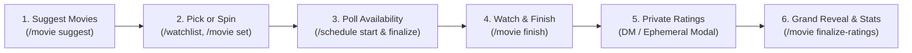

# 🎬 Discord Movie Night Bot: Complete Setup & Deployment Manual

This manual provides a comprehensive, step-by-step guide to installing, configuring, and running the Movie Night Bot in an existing Discord server.

---

## 📑 Table of Contents
1. [Prerequisites](#1-prerequisites)
2. [TMDB (The Movie Database) API Key Setup](#2-tmdb-the-movie-database-api-key-setup)
3. [Discord Developer Portal & Bot Creation](#3-discord-developer-portal--bot-creation)
4. [Discord Server Preparation](#4-discord-server-preparation)
5. [Bot Installation & Environment Configuration](#5-bot-installation--environment-configuration)
6. [Launching the Bot](#6-launching-the-bot)
7. [Running 24/7 on Linux or Raspberry Pi (systemd)](#7-running-247-on-linux-or-raspberry-pi-systemd)
8. [Step-by-Step Server Testing & Usage Walkthrough](#8-step-by-step-server-testing--usage-walkthrough)
9. [Troubleshooting & Common Pitfalls](#9-troubleshooting--common-pitfalls)
10. [Database Backup & Maintenance](#10-database-backup--maintenance)

---

## 1. Prerequisites

Before starting, ensure you have:
* **Node.js**: Version **`20.x`** or **`22.x LTS`** installed ([nodejs.org](https://nodejs.org/)). Verify with:
  ```bash
  node -v
  npm -v
  ```
* **Administrator permissions** (or "Manage Server" permissions) in your Discord server.
* A Discord account with **Developer Mode** enabled (*Discord Settings > Advanced > Developer Mode* toggled **ON**).

---

## 2. TMDB (The Movie Database) API Key Setup

The bot uses TMDB for live movie autocomplete, poster artwork, runtimes, synopses, and IMDb cross-referencing.

1. Go to [themoviedb.org](https://www.themoviedb.org/) and create a free account (or log in).
2. Go to your **Account Settings** (click your profile avatar top right) > **[API](https://www.themoviedb.org/settings/api)**.
3. Click **Create** > choose **Developer** > accept the terms.
4. Fill in the short registration form:
   * **Application Name**: `Movie Night Bot`
   * **Application URL**: Your Discord server invite URL or a placeholder (e.g. `http://localhost`)
   * **Application Summary**: A private movie night scheduling bot for friends.
5. Once submitted, copy your **API Key (v3 auth)** (a 32-character hex string). Save this as `TMDB_API_KEY`.

---

## 3. Discord Developer Portal & Bot Creation

### Step 3.1: Create Application
1. Navigate to the [Discord Developer Portal](https://discord.com/developers/applications).
2. Click **New Application** in the top right.
3. Name it (e.g., `Movie Night`) and click **Create**.
4. On the **General Information** page:
   - Copy the **Application ID** (save this as `DISCORD_CLIENT_ID`).
   - *(Optional)* Upload an icon for the bot (e.g. popcorn or film reel).

### Step 3.2: Configure the Bot User & Privileged Intents
1. In the left sidebar, click **Bot**.
2. Click **Reset Token**, confirm, and copy the new token. 
   > ⚠️ **Important**: Save this as `DISCORD_TOKEN`. Keep it secret; never share or commit it to GitHub.
3. Scroll down to **Privileged Gateway Intents**:
   - Toggle **Server Members Intent** to **ON** (required so the bot can fetch member names and scan voice channels for attendance).
4. Click **Save Changes** at the bottom.

### Step 3.3: Generate OAuth2 Invite URL
1. In the left sidebar, click **OAuth2** > **URL Generator**.
2. Under **Scopes**, check:
   - `bot`
   - `applications.commands` (enables Slash `/` commands)
3. Under **Bot Permissions**, check:
   - **General Permissions**:
     - `View Channels`
     - `Manage Events` *(needed for `/schedule finalize` to create native Discord Scheduled Events)*
   - **Text Permissions**:
     - `Send Messages`
     - `Send Messages in Threads`
     - `Embed Links`
     - `Attach Files`
     - `Read Message History`
     - `Use External Emojis`
   - **Voice Permissions**:
     - `Connect` *(allows detecting who is in the movie voice channel during `/movie finish`)*
4. Copy the generated **Invite URL** at the bottom of the page.
5. Paste the URL into your browser, select your server from the dropdown, and authorize the bot to join your server.

---

## 4. Discord Server Preparation

### Step 4.1: Text Channel Setup
The bot posts movie polls, announcements, rating fallbacks, and the grand reveal card into a designated text channel.
1. Check your existing channels or create a new text channel:
   - Default recommended name: `#shows-n-movies`
   - If you want to use another channel (e.g., `#movie-night` or `#general`), you can customize this in the `.env` file (`MOVIE_CHANNEL_NAME`).
2. Ensure the bot's role has permission to **View Channel** and **Send Messages** in that channel.

### Step 4.2: Voice Channel Setup
1. Ensure your server has a voice channel where you stream or watch movies (e.g., `Movie Room` or `General Voice`).
2. The bot only reads who is sitting in the voice channel when an admin runs `/movie finish`—it does not need to stream audio.

### Step 4.3: Copy Server & Role IDs (For Instant Slash Commands)
1. In Discord, right-click your Server icon in the server list and select **Copy Server ID**. Save this as `DISCORD_GUILD_ID`.
   > 💡 **Why this matters**: Supplying `DISCORD_GUILD_ID` makes slash commands appear **instantly** in your server. Without it, Discord takes up to 1 hour to propagate global commands.
2. *(Optional)* If you want to restrict admin actions (e.g., scheduling polls and removing movies) to a specific role:
   - Go to *Server Settings > Roles*, right-click the moderator/admin role, and choose **Copy Role ID**. Save this as `ADMIN_ROLE_ID`.

---

## 5. Bot Installation & Environment Configuration

### Step 5.1: Install Dependencies
Open a terminal in the bot's project folder:

```bash
npm install
```

### Step 5.2: Create and Populate `.env`
In the root directory of the project, create a file named `.env` (or copy `.env.example`):

```bash
cp .env.example .env
```

Edit `.env` with your favorite text editor:

```ini
# Discord Bot Credentials
DISCORD_TOKEN=your_bot_token_from_step_3_2
DISCORD_CLIENT_ID=your_application_id_from_step_3_1
DISCORD_GUILD_ID=your_server_id_from_step_4_3

# Text channel where polls and reviews will be posted (name or channel ID)
MOVIE_CHANNEL_NAME=shows-n-movies

# TMDB API Key (v3 auth from step 2)
TMDB_API_KEY=your_tmdb_api_key_here

# Local SQLite database path (embedded, zero extra setup)
DATABASE_URL=file:movienight.db

# Optional: Specific Discord Role ID for admin controls
ADMIN_ROLE_ID=
```

### Step 5.3: Initialize the SQLite Database
The bot automatically verifies and creates all tables on startup, but you can also manually verify migrations:

```bash
npm run db:migrate
```
*You should see `[DB] Database tables verified successfully.`*

---

## 6. Launching the Bot

### Option A: Development / Testing Mode (with live hot reload)
```bash
npm run dev
```

### Option B: Production Build & Run
```bash
# 1. Compile TypeScript to dist/
npm run build

# 2. Run the compiled JavaScript
npm start
```

### Verify Successful Startup
When the bot starts up, the console will print:
```text
[Bot] Logged in successfully as Movie Night#1234!
[Bot] Active in 1 server(s).
[DB] Ensuring database tables are initialized...
[DB] Database tables verified successfully.
[Commands] Started refreshing 4 application (/) commands.
[Commands] Successfully registered 4 commands to guild 123456789012345678.
[Bot] Movie Night Bot is fully ready and listening for events.
```
In your Discord server, the bot will now show an **Online** status indicator.

---

## 7. Running 24/7 on Linux or Raspberry Pi (`systemd`)

The bot is designed to be lightweight (~40MB RAM), making it perfect for a **Raspberry Pi Zero 2 W / 3 / 4 / 5** or any Linux VPS.

1. Build the production files on your server:
   ```bash
   npm run build
   ```
2. Create a systemd unit file:
   ```bash
   sudo nano /etc/systemd/system/movienight.service
   ```
3. Paste the following configuration (replace `/home/pi/disc-movienight` and `pi` with your actual directory and username):
   ```ini
   [Unit]
   Description=Discord Movie Night Bot
   After=network.target

   [Service]
   Type=simple
   User=pi
   WorkingDirectory=/home/pi/disc-movienight
   ExecStart=/usr/bin/node dist/index.js
   Restart=on-failure
   RestartSec=10
   Environment=NODE_ENV=production

   [Install]
   WantedBy=multi-user.target
   ```
4. Reload systemd, enable the service on boot, and start it:
   ```bash
   sudo systemctl daemon-reload
   sudo systemctl enable movienight
   sudo systemctl start movienight
   ```
5. Check service status and view live logs:
   ```bash
   sudo systemctl status movienight
   journalctl -u movienight -f
   ```

---

## 8. Step-by-Step Server Testing & Usage Walkthrough



### Step 1: Suggesting Movies & Admin Delegation
In any channel where slash commands are permitted:
* Type `/movie suggest movie:`
  * As you type a title (e.g. `Interstellar`), TMDB autocomplete populates suggestions with release years.
  * You can also paste an IMDb link (e.g. `https://www.imdb.com/title/tt0816692/`) or IMDb ID (`tt0816692`).
  * **Admin Delegation (`user: @member`)**: Server administrators can optionally provide the `user:` argument to attribute the suggestion on behalf of another friend!
* Press Enter. The bot posts a rich card with the poster, synopsis, runtime, and the suggester's tag.
* Duplicate prevention will warn you if the movie is already in backlog or has already been watched (with past score and date).
* **Admin Reassign (`/movie set-suggester`)**: Admins can change who suggested an existing movie in the backlog or watched history anytime using `/movie set-suggester movie: <selection> user: @member`.

### Step 2: Browsing & Spinner Wheel Export
* `/movie list [status] [user]`: Displays movies with optional filters for status (`backlog`, `watched`, `planned`, `all`) or filters by the friend who suggested them.
* `/watchlist wheel-export`: Generates a clean list of titles and a **pre-populated direct link to [Picker Wheel](https://pickerwheel.com)** for spinning the wheel live during voice chat!

### Step 3: Setting the Planned Feature & Syncing Events
* `/movie set movie:`
  * Uses Discord autocomplete filtered to your backlog (e.g. `[#1] The Matrix (1999)`), preventing typos.
  * **Automatic Event & Poll Sync**: If a scheduling poll is active, or a Discord Scheduled Event was already created, running `/movie set` automatically updates the event name, synopsis, runtime, and the active poll embed!

### Step 4: Weekly Scheduling Poll & Event Management
* `/schedule start days:Friday, Saturday, Sunday time:8:00 PM`
  * **Requires a movie to be locked in first** (`/movie set`).
  * Generates an interactive voting embed with interactive toggle buttons for each day plus an `❌ Cannot make it` button.
  * Displays the runtime and poster of the planned movie so members know how much time to budget.
  * **Reboot-proof**: All button clicks write directly to SQLite, so restarting the bot won't lose votes.
* `/schedule finalize day:Saturday time:8:00 PM`
  * Announces the winning slot, locks the poll buttons, and automatically schedules a **native Discord Event** in your server.
* `/schedule modify day:Sunday time:7:30 PM`
  * Want to change the day or time after finalizing? Run `/schedule modify` to adjust the date or time anytime. The linked **Discord Scheduled Event** is automatically updated!
* `/schedule cancel`
  * Cancels the active schedule and automatically removes the Discord Scheduled Event from the server.
* `/schedule current`
  * Check the current schedule status and linked Discord event ID.

### Step 5: Finishing the Movie & Attendance
* When the movie finishes in your voice channel, run:
  `/movie finish`
* The bot inspects who is sitting in the voice channel alongside anyone who RSVP'd.
* An **Admin Confirmation Window** opens with a 10-second timer and a member dropdown.
  * You can immediately uncheck anyone who just dropped by, or add someone who watched on mobile/stream without voice.
  * If no changes are needed, click **Confirm Now** (or wait 10 seconds for automatic confirmation).

### Step 6: Dual-Channel Private Rating Collection
* Once attendance is confirmed:
  1. Attendees receive a direct message with a `[⭐ Submit Your Rating & Review]` button.
  2. For attendees who have server DMs blocked, an in-channel fallback button is simultaneously posted in `#shows-n-movies`.
* Clicking the button opens a private pop-up form (Modal):
  * **Score**: Accepts `8`, `8.5`, `8,5`, `8/10`.
  * **Review**: Optional text review (up to 1,000 characters).
* Submissions can be updated anytime before the reveal by clicking the button again.

### Step 7: Rating Tracking & Grand Reveal
* `/movie status`: Checks live submissions (e.g., `4/5 submitted — Waiting on: @Eve`).
* `/movie nudge`: Pings members who haven't submitted yet.
* `/movie finalize-ratings`: Unveils the Grand Results embed in `#shows-n-movies`:
  * **Group Average Score** (e.g., `⭐ 8.42 / 10`)
  * **Critic's Choice** (Highest score) & **The Tough Crowd** (Lowest score)
  * Individual member scores with their full written reviews.
  * Moves the movie from `backlog` to `watched`.

### Step 8: Hall of Fame & Member Stats
* `/movie leaderboard`: Ranks all watched films in the server Hall of Fame.
* `/movie stats user:@friend`: Displays total movies attended, personal average score, and **how highly the group rated the movies that user recommended**!

---

## 9. Troubleshooting & Common Pitfalls

| Issue | Cause | Solution |
| :--- | :--- | :--- |
| **Slash commands (`/`) don't appear in Discord** | Guild ID missing or Discord cache delay | Ensure `DISCORD_GUILD_ID` is set in `.env`. Restart the bot; guild commands register instantly. Also verify the bot was invited with the `applications.commands` scope. |
| **Voice channel attendance detects 0 members** | Missing Privileged Intent or Bot disconnected | 1. Go to Discord Developer Portal > Bot > enable **Server Members Intent**.<br>2. Ensure the user running `/movie finish` is connected to the voice channel when running the command. |
| **Discord Event not created on `/schedule finalize`** | Missing `Manage Events` permission | Ensure the bot's role has the **Manage Events** permission enabled in your server roles. |
| **Ratings modal won't send in DMs** | User has "Direct Messages from server members" turned off | No action needed! Attendees can click the `[⭐ Submit Your Rating & Review]` button posted directly in `#shows-n-movies`. Modals submitted this way are completely ephemeral and private. |
| **TMDB searches return no results** | Missing or invalid TMDB API Key | Check that `TMDB_API_KEY` in `.env` is your 32-character v3 key. Restart the bot. |
| **Bot logs in, but doesn't post to `#shows-n-movies`** | Channel name mismatch | Verify the channel exists and matches `MOVIE_CHANNEL_NAME` in `.env` (case-insensitive, `#` prefix optional). You can also set `MOVIE_CHANNEL_NAME` to the exact numeric Channel ID. |

---

## 10. Database Backup & Maintenance

All movie backlog records, attendance, and reviews live in a single self-contained SQLite file: `movienight.db`.

You can perform safe, zero-downtime hot backups anytime while the bot is running:
```bash
sqlite3 movienight.db ".backup 'movienight-backup.db'"
```
To automate daily backups on Linux or Raspberry Pi, add a cron job:
```bash
crontab -e
# Backup every night at 3 AM:
0 3 * * * sqlite3 /home/pi/disc-movienight/movienight.db ".backup '/home/pi/disc-movienight/backups/movienight-$(date +\%F).db'"
```

