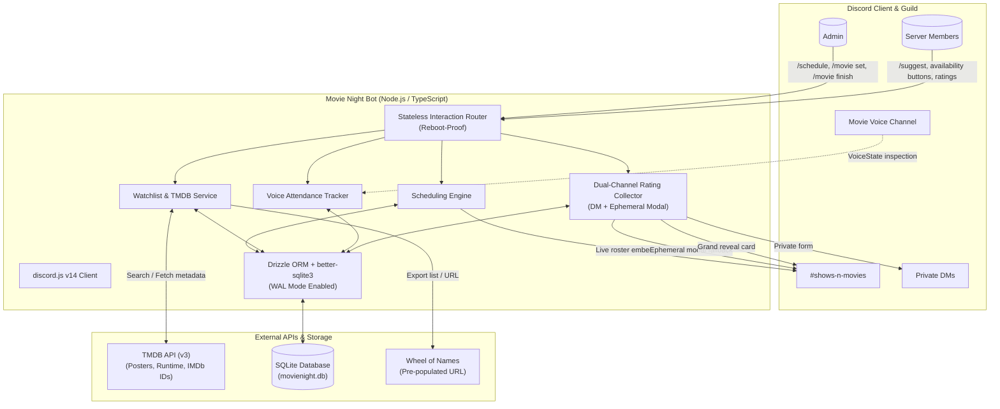
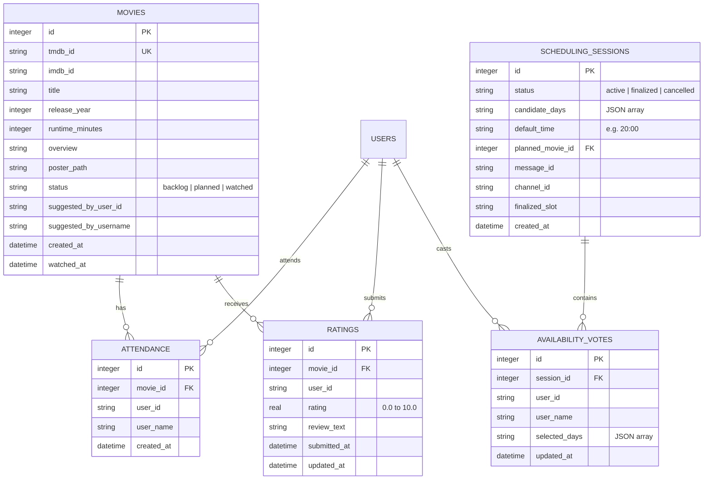
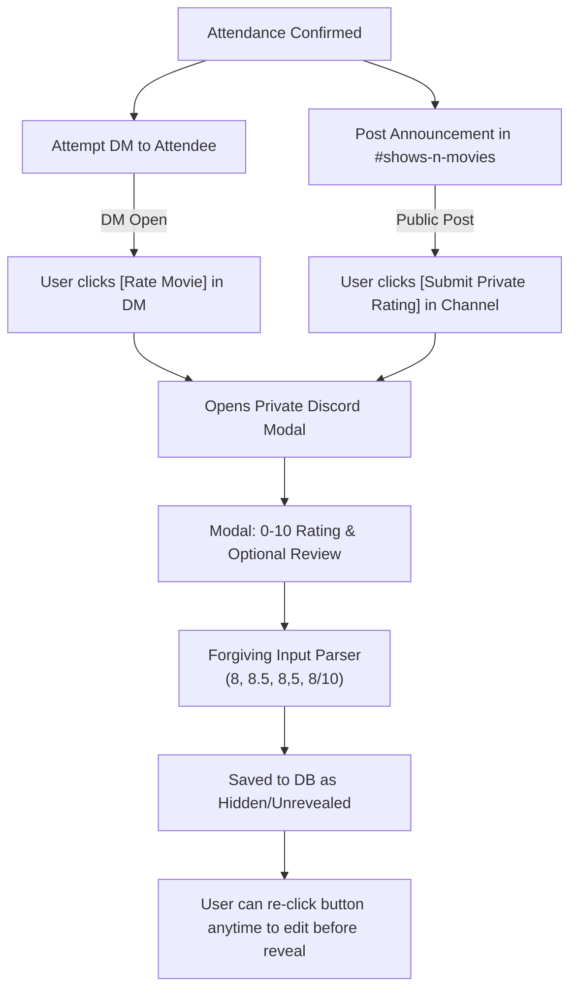

# Implementation Plan - Discord Movie Night Bot

A robust, tailored Discord bot for weekly friend group movie nights, engineered to run 24/7 on a **Raspberry Pi Zero 2 W** alongside Pi-hole. The bot handles weekly availability scheduling, movie suggestions/backlog, voice channel attendance detection, private rating collection (0–10 with half-points), and a grand reveal of group scores and reviews.

---

## 1. System Architecture & Tech Stack



### Why this stack?
- **Runtime & Language**: Node.js (v20+) with TypeScript for strict type safety and modern async handling.
- **Discord Library**: `discord.js` (v14) using modern Discord features: Slash Commands with Autocomplete, Buttons, Modals, Scheduled Events, and Voice State inspection.
- **Database & Storage**: **SQLite** via `better-sqlite3` and **Drizzle ORM**:
  - Extremely lightweight (~40–50 MB RAM), compiling down to tiny C bindings. Perfect for the **512 MB RAM budget on a Raspberry Pi Zero 2 W** alongside Pi-hole.
  - Zero cloud dependency, zero monthly costs, single-file backup (`movienight.db`).
  - **SD Card Protection**: Configured with `PRAGMA journal_mode = WAL;` and `PRAGMA synchronous = NORMAL;` to minimize flash wear and prevent database locking.
- **Metadata Provider**: **TMDB API (v3)**:
  - Free API key with instant signup.
  - Returns posters, synopsis, genres, runtime, release year, and external links including the exact **IMDb ID** (`tt1234567`).

---

## 2. Database Schema (SQLite via Drizzle ORM)



---

## 3. End-to-End User Workflows

### Workflow 1: Movie Suggestions & Watchlist
1. **Suggesting Movies**:
   - Any member runs `/suggest <movie>`.
   - Discord offers **live autocomplete** querying TMDB search to display `Title (Year) [IMDb ID]`.
   - Members can also paste an **IMDb URL/ID** (e.g. `tt0111161`) or a **TMDB link/ID**.
   - **Duplicate & History Check**:
     - If the movie was already watched: Bot responds *"We already watched this on [Date]! It scored a group rating of ⭐ 8.2/10. (Add with --rewatch to watch again)."*
     - If already in the backlog: Bot responds *"Already in the watchlist (suggested by @User on [Date])."*
   - If new, fetches metadata (overview, poster, runtime, IMDb ID) and adds to database with status `backlog`, crediting the suggester.
   - Posts a rich confirmation embed in `#shows-n-movies` with poster, runtime, and IMDb link.
2. **Watchlist & Spinner Wheel Support**:
   - `/watchlist [filter: backlog|watched]`: Displays a paginated list of movies.
   - `/watchlist remove movie:<selection>`: Allows original suggester or Admin to remove an entry.
   - `/watchlist wheel-export`: Generates a clean comma-separated list of titles AND a pre-populated direct link to **Wheel of Names** with all backlog movies loaded!
   - `/movie random [count]`: Quick in-Discord random draw of 1–5 candidate movies from the backlog.
3. **Setting the Planned Movie (Typo-Proof Selection)**:
   - After spinning the wheel, Admin runs `/movie set movie:<selection>`.
   - The `movie` parameter uses **Discord Autocomplete** filtered to current backlog movies (e.g., `[#12] The Matrix (1999)`), passing the exact internal database ID to prevent typos.
   - Admin can also paste an IMDb URL or ID directly if scheduling a movie not previously in the backlog.
   - Status updates from `backlog` to `planned`.

---

### Workflow 2: Weekly Availability & Scheduling
1. **Starting Availability Solicitation**:
   - Admin runs `/schedule start [days: Fri,Sat,Sun] [time: 8:00 PM]`.
   - If a movie is `planned`, the embed displays the title, poster, and **Runtime: X hrs Y mins** so members know how long the movie runs.
   - Posts an interactive message in `#shows-n-movies` with:
     - Day toggle buttons (`[Friday]`, `[Saturday]`, `[Sunday]`) and a `[Cannot make it]` button.
     - A live roster embed displaying who is available on each day.
2. **Stateless, Reboot-Proof Voting**:
   - Buttons use persistent custom IDs (e.g. `sched:toggle:<sessionId>:<dayIndex>`).
   - If the Raspberry Pi reboots or updates while the poll is active, voting continues without issue—the global event router looks up the session directly in SQLite.
   - Members can select multiple days. Clicking an active day toggles it off. Clicking `[Cannot make it]` clears active days and records their status.
3. **Finalization or Rescheduling**:
   - Admin runs `/schedule finalize day:Saturday [time: 8:30 PM]` (with optional custom time override).
   - Bot announces the winning day/time, locks buttons, and automatically creates a native **Discord Scheduled Event** on the server so members get push notifications.
   - If plans change, Admin can run `/schedule cancel` or `/schedule reschedule`.

---

### Workflow 3: Voice Attendance Tracking
1. **Triggering Movie Completion**:
   - When the movie ends, Admin runs `/movie finish`.
2. **Auto-Detection with 10-Second Admin Confirmation Screen**:
   - Bot inspects the Voice Channel state (`voiceChannel.members`) and cross-references anyone who RSVP'd "Yes" in the scheduling poll.
   - Bot presents the Admin with an **ephemeral confirmation screen containing a User Multi-Select checklist** pre-populated with detected attendees.
   - A 10-second interactive confirmation window allows the Admin to quickly uncheck anyone who just dropped in to chat or check anyone who watched on screen-share without joining mic.
   - Admin clicks `[Confirm Attendees & Send Rating Requests]` (or after the 10-second window if auto-confirmed, or on click). Attendance is saved to the `attendance` table.

---

### Workflow 4: Dual-Channel Private Rating Collection
To solve the frequent issue where members have direct messages disabled from server members (Discord error `50007`), the bot implements a **dual-channel submission system**:



1. **Direct Message Dispatch**:
   - Sends a DM to each confirmed attendee with poster, title, IMDb link, and a `[Rate Movie]` button.
2. **In-Channel Ephemeral Fallback**:
   - Simultaneously posts in `#shows-n-movies`:
     > *"🎬 That's a wrap on **The Matrix**! Check your DMs for your rating form. If your DMs are closed, click **[Submit Private Rating]** below."*
   - Clicking this in-channel button opens an **ephemeral modal** visible ONLY to that user. Their rating and review remain completely private until the grand reveal!
3. **Forgiving Rating Parser**:
   - Accepts integers (`8`), decimals (`8.5`), commas (`8,5`), and fractions (`8/10`).
   - Normalizes to a 0.0–10.0 scale with 0.1 or 0.5 precision.
   - If an attendee makes a typo, they can click `[Rate Movie]` again before finalization to update their rating and review.

---

### Workflow 5: Grand Reveal, Deadlock Prevention & Stats
1. **Deadlock Prevention ("The Sleepy Friend" Solution)**:
   - `/movie status`: Shows real-time submission progress:
     > 🎬 **The Matrix (1999)** — 4 / 5 ratings submitted  
     > ✅ Alice, Bob, Charlie, Dave  
     > ⏳ Waiting on: @Eve
   - `/movie nudge`: Pings pending attendees in DM / channel.
   - Admin can run `/movie finalize-ratings` at any time without waiting for unresponsive members. Unsubmitted members are marked `Attended (No review)` and the average is computed from submitted scores.
2. **The Grand Reveal Card**:
   - When finalized, the bot posts a formatted card in `#shows-n-movies`:
     - **Header & Poster**: Title, Year, Runtime, IMDb link, Suggester credit.
     - **Group Average**: e.g., ⭐ **8.42 / 10** (based on 5 reviews).
     - **Highs & Lows**: Highest rating and lowest rating of the night ("Critic's Choice" & "The Hater" awards).
     - **Reviews**: Each member's rating with their written review in quotes.
   - Movie status is updated to `watched`, and `watched_at` timestamp is saved.
3. **Stats & Leaderboard**:
   - `/movie leaderboard`: Shows all watched movies ranked by group average score with attendance counts.
   - `/movie stats [user]`:
     - **Attendance**: Total movie nights attended.
     - **Personal Ratings**: Average rating given; highest and lowest rated films.
     - **Recommendation Track Record**: Movies suggested by this user that were watched, and the **group average rating** for their recommendations (e.g. *"Alice's recommendations average ⭐ 8.1 / 10 across 4 movies"*).

---

## 4. Raspberry Pi Zero 2 W Durability & Performance

1. **Memory Footprint**:
   - Node.js running compiled TypeScript via `tsc` (runs as raw JavaScript via `node dist/index.js`).
   - Typical memory footprint: ~35–50 MB RAM, leaving ~450 MB for the OS and Pi-hole.
2. **SD Card Durability**:
   - SQLite configured with:
     ```sql
     PRAGMA journal_mode = WAL;
     PRAGMA synchronous = NORMAL;
     PRAGMA busy_timeout = 5000;
     ```
   - Eliminates database locking and reduces SD card flash write cycles.
3. **Process Management**:
   - Managed via `systemd` service (`movienight.service`) or `pm2`:
     - Auto-starts on boot.
     - Auto-restarts on unexpected error.
4. **Automated Backups**:
   - `/admin backup` command executes `VACUUM INTO 'movienight-backup.db'` safely without stopping the bot.

---

## 5. File Structure

```
d:/antigravity/disc-movienight/
├── src/
│   ├── index.ts                # Client initialization & global interaction router
│   ├── config.ts               # Env configuration (Tokens, TMDB key, Guild IDs)
│   ├── db/
│   │   ├── schema.ts           # Drizzle ORM schema (movies, attendance, ratings, sessions)
│   │   ├── client.ts           # better-sqlite3 connection with WAL mode
│   │   └── migrations/         # Auto-generated Drizzle migration files
│   ├── services/
│   │   ├── tmdb.service.ts     # TMDB API client (search, details, IMDb ID, posters)
│   │   ├── movie.service.ts    # Watchlist CRUD, duplicate detection, wheel export
│   │   ├── schedule.service.ts # Availability aggregation & Discord Scheduled Events
│   │   ├── attendance.service.ts # Voice channel inspection & RSVP correlation
│   │   └── rating.service.ts   # Dual-channel dispatches, modal handler, grand reveal card
│   ├── commands/
│   │   ├── suggest.ts          # /suggest with TMDB autocomplete
│   │   ├── watchlist.ts        # /watchlist, /watchlist remove, /watchlist wheel-export
│   │   ├── schedule.ts         # /schedule start, finalize, cancel
│   │   └── movie.ts            # /movie set, start, finish, status, nudge, finalize-ratings, stats, leaderboard
│   ├── components/
│   │   ├── scheduleButtons.ts  # Stateless sched:toggle handlers
│   │   ├── attendanceModal.ts  # Admin attendee confirmation checklist
│   │   └── ratingModal.ts      # Dual-channel 0-10 modal submission & parser
│   └── utils/
│       ├── discordHelpers.ts   # Embed builders & formatters
│       ├── ratingParser.ts     # Forgiving rating validator (8, 8.5, 8/10)
│       └── wheelHelper.ts      # Wheel of Names URL generator
├── drizzle.config.ts           # Drizzle config
├── package.json                # Dependencies & scripts
├── tsconfig.json               # TypeScript configuration
└── .env.example                # Sample environment variables
```

---

## 6. Required Discord Bot Permissions & Intents

In the **Discord Developer Portal**:
1. **Privileged Gateway Intents**:
   - `Server Members Intent` (GuildMembers) — to resolve server members and fetch usernames.
2. **Bot Permissions**:
   - `Send Messages` & `Embed Links` (in `#shows-n-movies`).
   - `Manage Events` (to create Discord Scheduled Events).
   - `View Channels` & `Connect` (to inspect voice channel attendee rosters).

---

## 7. Verification & Testing Plan

### Automated / Local Testing
1. **Unit Tests (Vitest)**:
   - `ratingParser.test.ts`: Validate `8`, `8.5`, `8,5`, `8/10`, and boundary rejection (`11`, `-1`, `abc`).
   - `wheelHelper.test.ts`: Verify generated Wheel of Names URL with encoded titles.
   - `movieStats.test.ts`: Test group average computation on user recommendations.
2. **Database Verification**:
   - Run Drizzle migrations on fresh SQLite database to verify foreign keys and constraints.

### Manual Verification
1. **Suggestions & Duplicates**:
   - Run `/suggest Inception`, verify autocomplete; suggest it again to verify duplicate detection message.
2. **Reboot-Proof Scheduling**:
   - Run `/schedule start`; toggle availability buttons; restart the bot process; verify buttons still respond and toggle properly.
3. **Voice Attendance Confirmation**:
   - Join voice channel; run `/movie finish`; verify pre-populated user checklist appears for admin confirmation.
4. **Dual-Channel Rating Submission**:
   - Test DM modal submission; test `#shows-n-movies` in-channel ephemeral modal submission; verify ratings remain hidden until finalized.
5. **Grand Reveal & User Stats**:
   - Run `/movie finalize-ratings`; verify grand reveal embed in `#shows-n-movies` with correct average and individual reviews.
   - Run `/movie stats @User`; verify attendance count, personal average, and recommendation group score.
