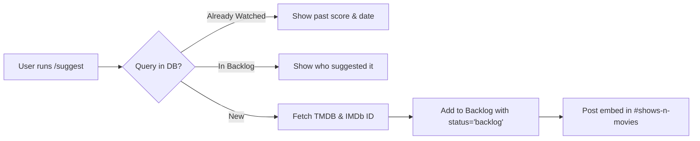
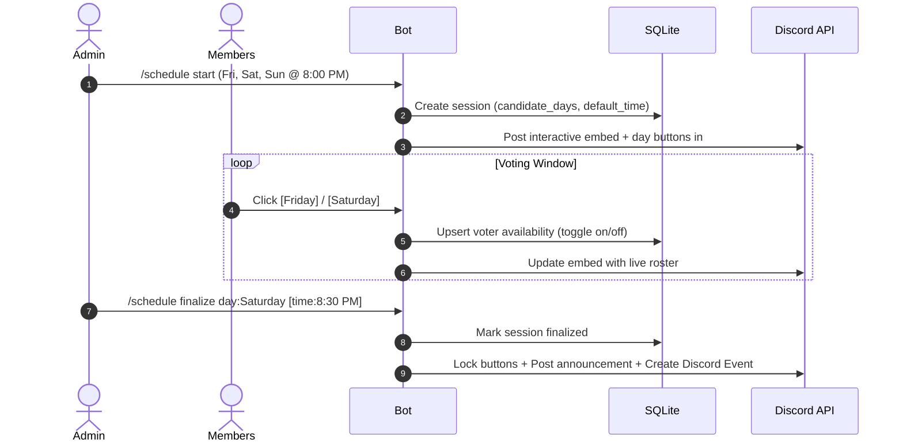
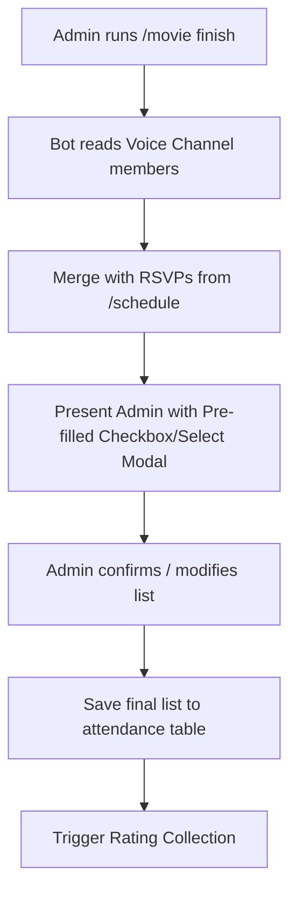
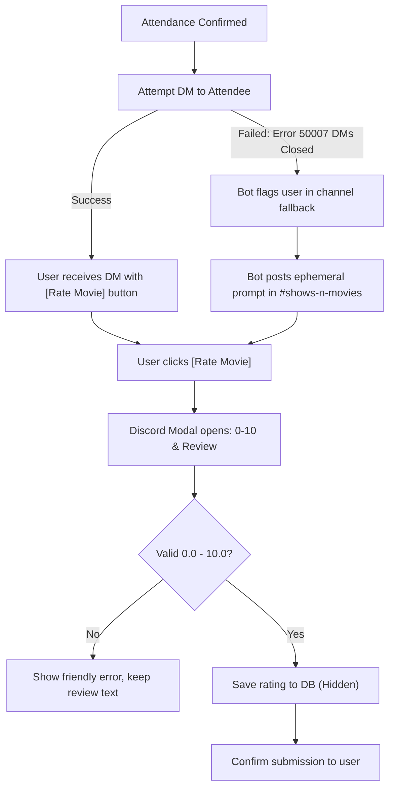
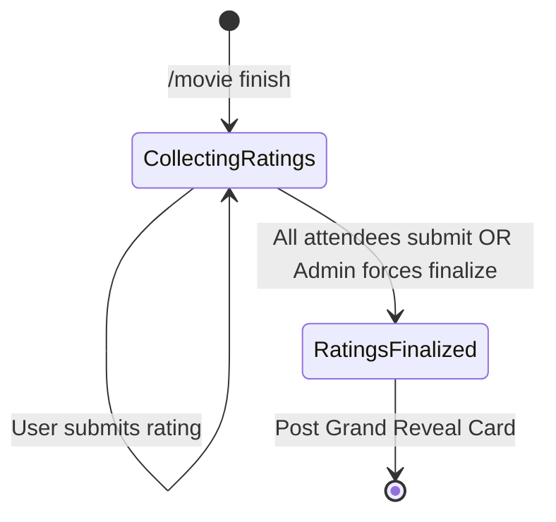

# Comprehensive Workflow & Design Review: Discord Movie Night Bot

This review evaluates the end-to-end architecture, user workflows, failure modes, and Discord platform constraints outlined in [movie_night_bot_plan.md](file:///C:/Users/Chris/.gemini/antigravity/brain/fa3a35e7-1a9f-4c0a-b6a6-54297dc001a2/movie_night_bot_plan.md).

---

## 1. Executive Summary

The proposed architecture is exceptionally well-suited for a friend group:
- **Strengths**: Using SQLite + Drizzle on a Raspberry Pi Zero 2 W alongside Pi-hole is cost-free, zero-maintenance, and low-overhead (~40 MB RAM). Discord Autocomplete eliminates typo friction, and TMDB integration brings rich visual polish.
- **Key Workflow Vulnerabilities Identified**:
  1. **Discord DM Privacy Block**: ~30–40% of Discord users disable DMs from server members by default.
  2. **Voice Channel Attendance Timing**: Snapshotting voice state at a single moment (`/movie finish`) risks missing members who left during credits or including friends who just joined to chat.
  3. **Interaction Collector Expiry**: In-memory button collectors break if the Raspberry Pi reboots.
  4. **The "Missing Voter" Deadlock**: One sleepy friend shouldn't block the grand reveal indefinitely.

Below is the deep dive into each workflow phase, with concrete solutions.

---

## 2. Phase-by-Phase Workflow Analysis

### Phase 1: Suggestions & Watchlist Management



#### Potential Failure Modes & Edge Cases:
1. **Duplicate Submissions**:
   - *Problem*: Two members suggest the same movie, or someone suggests a movie the group watched 6 months ago.
   - *Design Fix*: Before inserting, query by `tmdb_id`.
     - If status is `watched`: return *"We already watched this on [Date]! Group score: 8.2/10."* (with an optional `--allow-rewatch` flag).
     - If status is `backlog`: return *"Already in the watchlist, suggested by @Bob on [Date]."*
2. **Retracting / Cleaning Suggestions**:
   - *Problem*: Troll suggestions, duplicates, or changing one's mind.
   - *Design Fix*: Add `/watchlist remove movie:<id>` (permission: original suggester or Admin) and `/watchlist clear` (Admin only).
3. **Spinner Wheel Ergonomics**:
   - *Design Fix*: Support `/watchlist wheel-export` that returns both a clean copy-pasteable list of titles AND a pre-generated direct link to [Wheel of Names](https://wheelofnames.com) pre-populated with the backlog titles via URL parameter (or an in-Discord `/movie spin` animation!).

---

### Phase 2: Weekly Availability & Scheduling



#### Critical Design Refinements:
1. **Stateless Component Handlers (Reboot Survival)**:
   - *Critical Constraint*: If the Pi Zero reboots or updates while a weekly poll is active, all in-memory Discord collectors die.
   - *Architecture Fix*: Encode state into `customId`:
     - Button ID: `sched:toggle:<sessionId>:<dayIndex>`
     - Global router handles these without memory collectors: looks up `sessionId` in SQLite, flips the user's vote, and updates the message embed.
2. **Multi-Day Availability & Cancellation**:
   - Users must be able to toggle *multiple* days (e.g., "I can do Fri AND Sat").
   - Clicking a selected day toggles it off.
   - A dedicated `[Cannot Make It]` button clears all active days for that user and marks them as unavailable.
3. **Custom Time Overrides**:
   - Admin should be able to specify a different time during finalization: `/schedule finalize day:Saturday time:8:30 PM`.
4. **Native Discord Scheduled Event Integration**:
   - Once finalized, the bot should call Discord's `guild.scheduledEvents.create(...)`. Members can click "Interested" in Discord to receive native push notifications 15 minutes before showtime.

---

### Phase 3: Voice Attendance Tracking



#### Real-World Friction & Solution:
- *The Problem*: Movie night is 2 hours long. People leave right as the credits roll, or join voice 10 minutes late, or a non-watching friend pops in to chat. Snapshotting voice state at one exact second is error-prone.
- *The Solution*:
  1. Admin runs `/movie finish`.
  2. Bot fetches everyone currently in the voice channel, plus any members who RSVP'd "Yes" to this day during scheduling.
  3. Bot opens an **ephemeral Admin panel with a User Multi-Select menu** pre-checked with those users.
  4. Admin glances at the list, unchecks anyone who just popped in, checks anyone who watched on stream without joining voice, and clicks **[Confirm Attendees & Send Rating Requests]**.
  5. Takes the Admin 5 seconds, but ensures 100% data integrity.

---

### Phase 4: Rating Collection — The DM vs In-Channel Dilemma



#### Critical Discovery on Discord Modals:
- **Direct Messages vs Ephemeral Modals**:
  - Discord DMs fail frequently due to privacy settings.
  - **Game Changer**: An in-channel button configured to respond with an **Ephemeral Modal** can be used by *anyone* directly inside `#shows-n-movies`.
  - When User A clicks `[Rate Movie]` in `#shows-n-movies`, the pop-up modal is 100% private to User A. Neither their rating nor their review is visible to anyone else in the channel until the grand reveal!
- **Recommended Strategy**:
  - Send the DM to everyone whose DMs are open.
  - Simultaneously post an announcement in `#shows-n-movies`:
    > *"Movie Night complete! We sent rating forms to your DMs. If your DMs are closed, you can click **[Submit Private Rating]** right here in the channel!"*
  - This guarantees zero missed votes regardless of privacy settings.
- **Rating Input Ergonomics**:
  - Accept integers (`8`), decimals (`8.5`), commas (`8,5`), and fractions (`8/10`).
  - Allow users to click `[Rate Movie]` again before finalization to update their review if they change their mind.

---

### Phase 5: The Grand Reveal & Deadlock Prevention



#### Deadlock Prevention ("The Sleepy Friend" Problem):
- What if 4 people rate immediately, but 1 friend falls asleep?
- **Workflow Tools**:
  1. `/movie status`: Shows real-time progress:
     > 🎬 **The Matrix (1999)**  
     > Status: 4 / 5 ratings submitted  
     > ✅ Alice, Bob, Charlie, Dave  
     > ⏳ Waiting on: @Eve  
  2. `/movie nudge`: Sends a friendly ping/DM to pending attendees.
  3. `/movie finalize-ratings [force: true]`:
     - If all attendees submit, bot automatically announces or prompts admin to reveal.
     - If someone doesn't submit, Admin can finalize anytime. The unsubmitted member is marked as `Attended (No rating)`, and the average is computed from submitted scores.

#### Grand Reveal Visual Design:
The post in `#shows-n-movies` should be an event in itself:
```
============================================================
🎬 MOVIE NIGHT RESULTS: The Matrix (1999)
============================================================
⭐ GROUP RATING: 8.42 / 10  (5 reviews)
⏱ Runtime: 2h 16m | 🔗 IMDb: tt0133093 | 👤 Suggested by: @Bob

🏆 Highest Score: 9.5 / 10 by @Alice
📉 Lowest Score:  7.0 / 10 by @Charlie

💬 REVIEWS & THOUGHTS:
• @Alice (9.5/10): "Absolute masterpiece of sci-fi action, aged like fine wine."
• @Bob (9.0/10): "The lobby scene still gives me chills."
• @Dave (8.5/10): "Great concept, bullet time is iconic."
• @Eve (8.0/10): "A bit cheesy in the third act but really fun."
• @Charlie (7.0/10): "Keanu's acting is stiff but the world building is top tier."
============================================================
```

---

## 3. Database & Hardware Durability (Raspberry Pi Zero 2 W)

### SQLite on MicroSD Card Best Practices
Raspberry Pis run on MicroSD cards, which have limited write cycles. To protect against corruption:
1. **Enable WAL Mode (Write-Ahead Logging)**:
   ```sql
   PRAGMA journal_mode = WAL;
   PRAGMA synchronous = NORMAL;
   PRAGMA busy_timeout = 5000;
   ```
   - Eliminates database locks during concurrent reads/writes.
   - Minimizes SD card flash wear by consolidating small writes.
2. **Automated Zero-Effort Backups**:
   - Add a lightweight command: `/admin backup` or a weekly cron job that runs `VACUUM INTO 'backup.db'` and pushes to a private Git branch or local network share.

---

## 4. Summary of Recommended Adjustments

| Feature | Current Plan | Recommended Improvement |
| :--- | :--- | :--- |
| **Suggestion Duplicates** | Disallowed by DB constraint | Graceful detection: shows past watch date & score, or suggester info |
| **Availability Polls** | In-memory collectors | **Stateless custom IDs** (`sched:toggle:<id>`) that survive Pi reboots |
| **Voice Attendance** | Single-point snapshot | Snapshot + **Admin pre-filled confirmation modal** |
| **DM Block Workaround** | Fallback on error | **Dual channel**: DM + in-channel **Ephemeral Modal Button** |
| **Ratings Input** | Strict 0.0 - 10.0 text | Forgiving parser (handles `8,5`, `8/10`, half-points, re-editing) |
| **Missing Voters** | Potential stall | `/movie status`, `/movie nudge`, and Admin override on `/movie finalize-ratings` |
| **Wheel Integration** | Plain text export | Formatted text + pre-populated direct link for Wheel of Names |

---

## 5. Next Steps

With these workflow improvements integrated, the system will be resilient to Discord API edge cases, network blips, Pi reboots, and unpredictable human behavior.

Would you like to update the main implementation plan with these refinements, or proceed straight to scaffolding the project?
